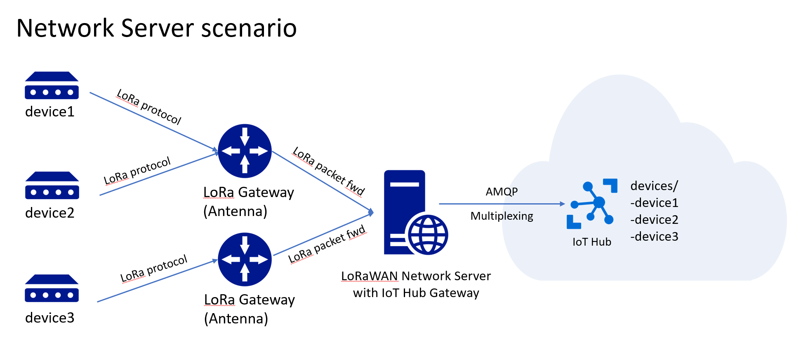

# Azure IoT Hub AMQP Server Gateway Sample

Travis: [](https://travis-ci.org/fbeltrao/IoTHubGateway)

## Introduction

The best way to connect any device to IoT Hub when building an IoT solution is to directly connect it using one of the provided [Microsoft Azure IoT Device SDKs](https://github.com/Azure/azure-iot-sdks).

Azure IoT Hub supports multiple protocols and offers extensive developer integration from REST API to [full device and service SDKs](https://github.com/Azure/azure-iot-sdks) in C, Python, Node.js, Java and .NET. In most cases, there is no need to build your own integration code from scratch.

In some cases however, for example when you need to do protocol translation or your client devices are simply not capable to connect directly to IoT hub, you need a gateway to bridge the gap.

The best way to implement this gateway scenario is to use IoT Edge as outlined in these [use cases and patterns](https://docs.microsoft.com/en-us/azure/iot-edge/iot-edge-as-gateway).

There is another scenario which we want to discuss here and which is not covered in the article above, where you need to implement a gateway at the server level and not at the Edge or the gateway may not support IoT Edge due to processing power or memory constraints or due to the lack of container support.

One of these cases could be a migration scenario where  you are unable to change the code running on the devices. In this case you need to implement an intermediary gateway that the devices can connect to without knowing about IoT hub.


Another use for the server gateway for example is to act as a [LoRaWAN](https://www.lora-alliance.org/technology) to IoT Hub connector. The LoRaWAN network server could include this gateway code to forward all the messages from the connected LoRa devices to IoT Hub.



## Note

The code provided in this sample is not production ready and was built for demonstration and illustration purposes. Hence, the code has sample quality. We have done some basic and scalability testing but no in depth validation.

## Solution Approach

In this sample, we created an ASP.NET Core solution to serve as our gateway.

It is crucial that a gateway solution should be able to multiplex device connections instead of creating single connections to IoT Hub per device. IoT Hub supports multiplexing only over HTTP and AMQP. For our sample gateway, we decided to use AMQP for its efficiency. The [Azure IoT Hub SDK for .NET](https://github.com/Azure/azure-iot-sdk-csharp) already implements support for connection pooling. Support for the other language SDKs are planned.

## Flow

When a device first wants to send a message through the gateway, in our example it calls a REST API, but this could be achieved using any accessible endpoint or protocol that the gateway supports. At this point, the gateway creates a new [DeviceClient](https://docs.microsoft.com/en-us/dotnet/api/microsoft.azure.devices.client.deviceclient?view=azure-dotnet) in order to connect to IoT Hub using the connection pool settings "Pooling = true" in [AmqpConnectionPoolSettings](https://docs.microsoft.com/en-us/dotnet/api/microsoft.azure.devices.client.amqpconnectionpoolsettings?view=azure-dotnet).

```csharp
var newDeviceClient = DeviceClient.Create(
    this.gatewayOptions.IoTHubHostName,
    auth,
    new ITransportSettings[]
    {
        new AmqpTransportSettings(TransportType.Amqp_Tcp_Only)
        {
            AmqpConnectionPoolSettings = new AmqpConnectionPoolSettings()
            {
                Pooling = true
            }
        }
    }
);
```

This forces every device client to share the same connection. By default, 995 devices are supported per connection. The SDK will add additional connections to the pool automatically if needed.

At this point, we are ready to send the message from the gateway to IoT Hub. 

To further optimize our sample, we don't want to create a new [DeviceClient](https://docs.microsoft.com/en-us/dotnet/api/microsoft.azure.devices.client.deviceclient?view=azure-dotnet) for every subsequent message the device wants to send. Instead, we keep it in a cache with a time to live (TTL) we can specify. If no new message comes in within this specified time, 1 hour in our case, the cache system will remove the [DeviceClient](https://docs.microsoft.com/en-us/dotnet/api/microsoft.azure.devices.client.deviceclient?view=azure-dotnet) from the cache.

## Authentication

In our example, we support two authentication mechanisms. In both cases, Iot Hub will see the message as being sent by the device itself rather than by the gateway.

### Authentication using a Shared Access Policy Key

Using the authentication method [DeviceAuthenticationWithSharedAccessPolicyKey](https://docs.microsoft.com/en-us/dotnet/api/microsoft.azure.devices.client.deviceauthenticationwithsharedaccesspolicykey?view=azure-dotnet) A single connection string allows the gateway to forward messages from all cleints to IoT hub without individual authentication for each of the devices. In this case, the gateway authenticates in behalf of the devices but does not impersonate them. This is the simplest solution, but it's not secure. 

You need to have a custom authentication mechanism in place between the devices and the gateway in this scenario to ensure security. This is useful in the scenario of a LoRaWAN network server, where an authenticaiton mechanism is already in place between the LoRa devices and their LoRaWAN gateway or server.

### Authentication using Tokens

Using the authentication method [DeviceAuthenticationWithToken](https://docs.microsoft.com/en-us/dotnet/api/microsoft.azure.devices.client.deviceauthenticationwithtoken?view=azure-dotnet) allows every device to authenticate to IoT hub directly, while still retaining the ability to share the connection among devices with pooling. In this case, the device has the SAS Key and generates a temporary token that it sends through the gateway to IoT Hub. IoT Hub is authenticating the device and not the gateway itself, effectively making it an end-to-end authentication. The  time-to-live set for the caching needs to be the same as the one for the SAS token.

## Sending messages from Cloud to Devices

### Direct Method

IoT Hub allows to do a callback to the connected device by calling a method on the device. For more information see ["Use direct methods"](https://docs.microsoft.com/en-us/azure/iot-hub/iot-hub-csharp-csharp-direct-methods).

In the gateway it's possible to listen for this event called by IoT hub. This call is synchronous. Depending on the protocol and the connection between device and our gateway, you need to implement your own callback solution which varies greatly based on the solution architecture and hence is out of the scope of this sample. For demonstration purposes, we simply log the method call to the console. For example, you could call the REST API of the LoRaWAN server from this event handler and pass the message downstream to the device.

### Cloud to Device Messages

For details Cloud to Device messages, see ["Send messages from the cloud to your device with IoT Hub"](https://docs.microsoft.com/en-us/azure/iot-hub/iot-hub-csharp-csharp-c2d)

We are evaluating the IoT SDK [DeviceClient.SetMessageHandlerAsync](https://docs.microsoft.com/en-us/dotnet/api/microsoft.azure.devices.client.deviceclient.setmessagehandlerasync?view=azure-dotnet) for this purposes (currently in preview) and will update the repository once we find a working version.
For now, the support to device messages is based on a background job that loops through the connected devices and check for messages. It is an approach that might not be advised for large device deployments.

### Device Twins

For details on how Device Twins work, see ["Understand and use device twins in IoT Hub"](https://docs.microsoft.com/en-us/azure/iot-hub/iot-hub-devguide-device-twins)

Support is not implemented in this gateway sample at the moment.

## Scaling

This solution was tested in a single instance, connecting 20'000 devices, sending and receiving messages. No problems were found. Since we open a device connection and keep in memory you should use affinity if you deploy the application in multiple instances, so that each device always communicates with the same instance.

If you enable cloud to device messages pay attention to the option "CloudMessageParallelism", as it dictate how fast your deployment will handle cloud messages. Direct methods don't have the same problem as the IoT SDK notifies when a direct method call is received.

## Configuration Options

Customization of the gateway is available through the configuration. The available options are:

|Setting|Description|Default|
|--|--|--|
|DeviceOperationTimeout|Device operation timeout (in milliseconds)|10 seconds (10'000)|
|IoTHubHostName|IoT Hub host name. Something like xxxxx.azure-devices.net|""|
|AccessPolicyName|The IoT Hub access policy name. A common value is iothubowner|""|
|AccessPolicyKey|The IoT Hub access policy key. Get it from Azure Portal|""|
|MaxPoolSize|The maximum pool size|ushort.MaxValue|
|SharedAccessPolicyKeyEnabled|Allows or not the usage of shared access policy keys.If you enable it make sure that access to the API is protected otherwise anyone will be able to impersonate devices|false|
|DefaultDeviceCacheInMinutes|Default device client cache in duration in minutes|60 minutes|
|DirectMethodEnabled|Enable/disables direct method (cloud -> device)|false|
|DirectMethodCallback|Gets/sets the callback to handle device direct methods|null|
|CloudMessagesEnabled|Enable/disables cloud messages in the gateway. Cloud messages are retrieved in a background job|false|
|CloudMessageParallelism|Degree of parallelism used to check for cloud messages|10|
|CloudMessageCallback|Gets/sets the callback to handle cloud messages|null|
## Contributors

Sascha Corti, Ronnie Saurenmann, Francisco Beltrao
